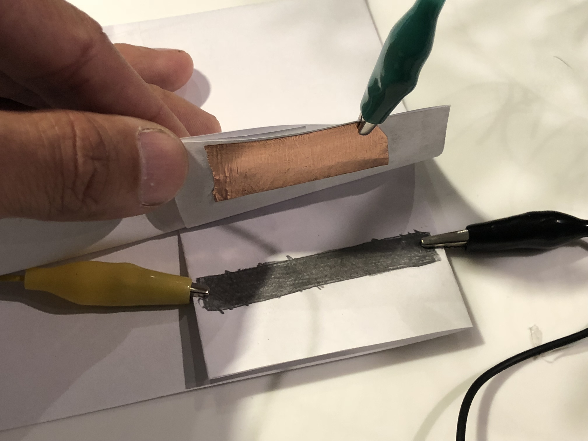

# diyPotentiometer

Simple Arduino touch sensor -> oF output
pencil lead, paper, copper tape, alligator cips, one resistor, arduino, openframeworks

### Instructions for use:

Color in a long bar on a piece of paper with a pencil. 

Pencil lead is a mix of graphite and clay. Graphite is conductive. Softer pencil leads have more graphite (so more conductive, and less resistance)

attach 5V to one end of the bar and GND to the other end

Attach a wire from Analog0 to anywhere along the colored in bar

The measured voltage should vary.

To prevent Analog 0 from floating around, insert a resistor between Analog 0 and GND.

Open the Arduino Serial Plotter to confirm the voltage changing

### Make a variable touchbar

Fold the paper with the graphite bar and apply a strip of copper tape to the other side of the fold.

Attach the alligator clip going to Analog 0 to the copper strip.

when the paper is folded, the copper tape should only touch the area that has graphite and not touch the alligator clips.

more at [http://memoir.okno.be/phys_comp_tutorial/ribbon4/ribbon4.htm](http://memoir.okno.be/phys_comp_tutorial/ribbon4/ribbon4.htm)

