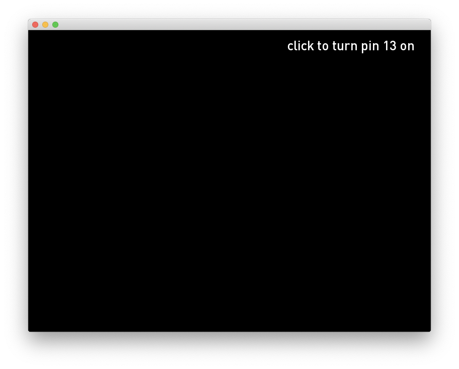

# About Firmarta Example 101

ofArduino + oF

### Instructions for use:

Open Arduino IDE > File > Examples > Firmata > StandardFirmata

upload Standard Firmata to your Arduino Board

Test arduino board with [Firmata Test application](http://www.pjrc.com/teensy/firmata_test/firmata_test.dmg)

Open Firmata Example 101 in oF

oF/examples/communication/firmataExample

In your terminal type "ls /dev/tty.*" to get a list of serial devices

copy "/dev/tty.usbserial-xxxxxxx" (your arduino port)  and replace "/dev/tty.usbmodemfd121"

